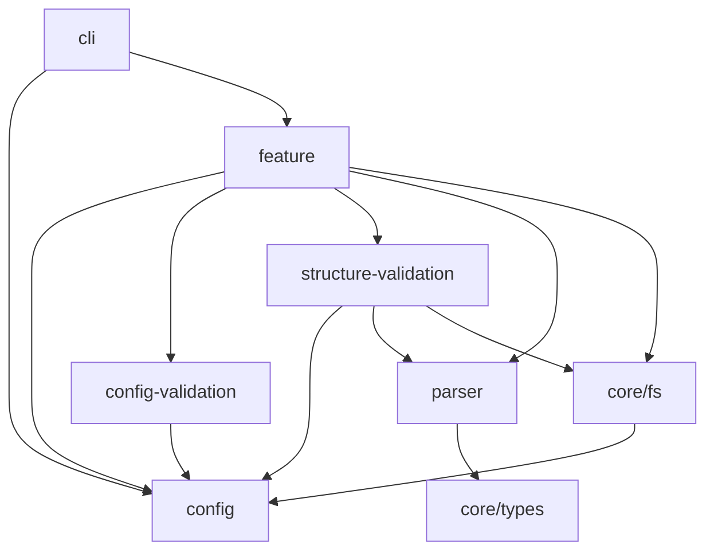

# fences

Fences helps you enforce inter-module boundaries within your Deno projects.

Fences is dog-fooded. See [`.fences.yaml`](./.fences.yaml) for an example of a
real configuration that is used by this repo.

## installation

```sh
git clone git@github.com:ayakovlenko/fences.git

deno task install
```

Verify installation:

```sh
$ fences version

0.1.0
```

## getting started

Create `.fences.yaml` in your project root directory and define your modules.

Run `fences check` to check the boundaries.

### check inter-module dependencies

```yaml
modules:
  - name: foo
    dependsOn:
      - bar
  - name: bar
    exposes:
      - mod.ts
```

In this example, module `foo` is allowed to import only from `bar` module from
`mod.ts`.

### check libraries

```yaml
modules:
  - name: foo
    libraries:
      - "@std/fs/"
```

In this example, module `foo` is allowed to import only from the `@std/fs`
library.

## architecture

_The following module graph is generated using `fences graph` command:_



## motivation

I started this project to help me develop and evolve medium to large size
projects alone. Establishing strict module dependencies early helps to make sure
that a project will remain maintainable and structured even after months of
development.

## contributing

If you feel you can contribute to this project, or you've found a bug, create an
issue or pull request.

This project is soley mantained, so it is prone to bugs and anti-patterns,
please call them out.

All contributions are highly appreciated!

[](https://star-history.com/#ayakovlenko/fences&Date)
