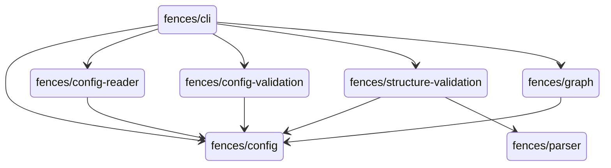

# fences

`fences` is a tool that ensures a high level of modularity in your codebase by
identifying and preventing unauthorized inter-module dependencies.

The tool analyzes your TypeScript code and flags any instances of prohibited
imports between modules, helping you maintain a clear separation of concerns and
minimizing the risk of code coupling and fragility.

## getting started

```sh
git clone git@github.com:ayakovlenko/fences.git

deno task install
```

See [.fences.yaml](./.fences.yaml) for an example configuration. This is the
real configuration for this project.

## modules


```mermaid
stateDiagram-v2
    state "fences/config" as s0
    state "fences/config-validation" as s1
    state "fences/structure-validation" as s2
    state "fences/parser" as s3
    state "fences/config-reader" as s4
    state "fences/cli" as s5
    state "fences/graph" as s6

    s1 --> s0
    s2 --> s0
    s2 --> s3
    s4 --> s0
    s5 --> s0
    s5 --> s4
    s5 --> s1
    s5 --> s2
    s5 --> s6
    s6 --> s0
```

## benefits of modules

There are several benefits to having a modular project structure:

1. Simplicity and maintainability: By dividing your project into smaller, more
   focused modules, you can reduce the complexity of your code and make it
   easier to understand, maintain, and update. You can also more easily identify
   and fix bugs when they arise.

1. Reusability: Modular code is often more reusable, meaning you can easily
   reuse modules in different parts of your project or in other projects
   altogether. This can save you time and effort when developing new features or
   projects.

1. Scalability: A modular project structure can also make it easier to scale
   your project. As your project grows, you can add new modules without
   affecting the existing codebase. This can help you avoid the "monolithic"
   codebase problem, where all code is tightly coupled and changes to one part
   of the codebase can cause unintended effects in other parts.

1. Collaboration: When working on a project with multiple developers, a modular
   project structure can facilitate collaboration. Each developer can work on
   their own module independently, without worrying about conflicts with other
   modules. This can lead to more efficient development and a faster
   time-to-market for your project.

Overall, a modular project structure can improve code quality, development
efficiency, and project scalability, making it a worthwhile investment for
developers and businesses alike.

## what's the idea here?

I want to write a tool that analyzes TypeScript dependencies (1), defines rules
for inter-dependencies (2), enforces those rules.

Let's say we have a project that starts as a monorepo but is expected to be
split into microservices if the business grows well and a need for scale arises.
The project starts as a monorepo with a code split into independent modules. The
modules might be sharing common utility code, but are independent otherwise. The
tool is supposed to enforce such consistency.

Intentional limitations:

- Remote dependencies are not deep-inspected

Rules:

- No circular dependencies (default)

Some unorganized thoughts as I'm drafting a definition file:

- First pass -- sanity
  - Are modules' paths directories?
  - Are names garbage?
    - [x] Unique
    - [ ] Exist
  - Are exports files?
  - Are imports valid export files?
- Source-level validation
  - Make sure modules are not nested moronically, e.g.: module "config/test"
    depends on "config"
  - Why? Because I don't want extra complexity of checking whether a nested
    module only imports an outside module through exposed files
  - Modules must be flat

## star history

[](https://star-history.com/#ayakovlenko/fences&Date)
